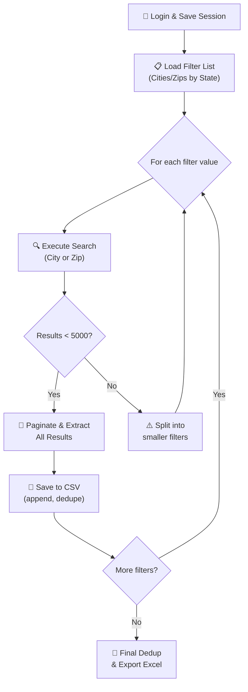

# 🏠 Bright MLS Member Directory Scraper — Action Plan

> [!IMPORTANT]
> Bright MLS covers **7 states + DC**: Delaware, Maryland, New Jersey (South/Central), Pennsylvania, Virginia, Washington D.C., and West Virginia. That's tens of thousands of agents across ~40,000 sq miles.

---

## 1. Approach Analysis — Why Playwright (Not Raw API)

| Approach | Pros | Cons | Verdict |
|----------|------|------|---------|
| **Raw `requests` + API replay** | Fast, lightweight | MLS uses SSO auth + anti-bot (Akamai), session tokens rotate, endpoints change without notice | ❌ Fragile |
| **HAR file download** | Worked for EXP (GraphQL) | Bright MLS member search isn't GraphQL — it's a traditional server-rendered MLS platform (Matrix/ConnectMLS). HAR replay won't scale across thousands of filter combos | ❌ Doesn't scale |
| **Playwright (headless browser)** | Reuses your real authenticated session (`auth_state.json` pattern you already use), handles JS rendering, survives anti-bot, easy to iterate filters | Slower than raw API, needs browser installed | ✅ **Best choice** |

**Recommendation: Playwright with Python** — exactly like your existing `auth_state.json` pattern. You'll log in once, save browser state, then the script reuses it for all subsequent runs.

---

## 2. Immediate Action Steps (Do This NOW)

### Step 1: Reconnaissance — Capture the Search Mechanism
1. Open **Chrome/Edge** → Log into Bright MLS
2. Navigate to **Search → Agents** (the member directory)
3. Open **DevTools** → **Network tab** → Check **"Preserve log"**
4. Perform a search for a **single small city** (e.g., "Bethesda, MD")
5. **Look for these in the Network tab**:
   - Any **XHR/Fetch** requests triggered when you click Search
   - The **URL pattern** (e.g., `/api/members/search`, `/matrix/...`, etc.)
   - The **request payload** (form data or JSON body with city/zip params)
   - The **response format** (HTML table? JSON array? XML?)
   - The **pagination mechanism** (page number in URL? offset parameter? "Next" button?)
6. **Right-click the search request** → **"Copy as cURL"** → Save it somewhere
7. Also check: Does the results page show total count? (e.g., "Showing 1-25 of 342")

### Step 2: Capture a Profile Detail Page
1. Click on **any agent's name** in the results
2. Check the **Network tab** for the detail page request
3. Note what fields are available: Name, Email, Phone, Office, License Type, **Designation/User Type**
4. **Screenshot** the profile page — I need to know exactly what fields are exposed

### Step 3: Report Back
Share with me:
- The **URL** of the search page (e.g., `https://matrix.brightmls.com/...`)
- The **cURL** command from the network tab
- Whether results are **HTML** or **JSON**
- The **pagination** style (page numbers, infinite scroll, "Load More"?)
- What **filter fields** are available (City, Zip, County, State, Name, Office, etc.)
- The **total member count** shown for a broad search (e.g., all of Maryland)

> [!TIP]
> If you see JSON responses, this makes our job MUCH easier — we can hit the API directly with `requests` and skip Playwright entirely. If it's HTML, Playwright is the way.

---

## 3. Architecture — The Scraper Blueprint



### Key Design Decisions:
- **Filter Strategy**: Iterate by **zip code** (most granular, almost guaranteed < 5,000 per zip)
- **Deduplication**: Use **MLS Agent ID** or **License Number** as the unique key
- **Resilience**: Checkpoint after each zip, so crashes resume from where they left off
- **Rate Limiting**: 2-3 second delays between requests to avoid detection
- **Data Captured**: Name, Email, Phone, Office, City, State, Zip, License #, **User Type/Designation**

---

## 4. Initial Code Architecture (Ready to Customize)

The script below is the **foundational skeleton**. Once you complete Steps 1-3 above and tell me the exact URL patterns, payload format, and response structure, I'll fill in the exact selectors/API calls.

### Files to be created:
| File | Purpose |
|------|---------|
| `bright_mls_scraper/config.py` | All settings, credentials, file paths |
| `bright_mls_scraper/zip_codes.py` | Complete list of zip codes for all 7 states |
| `bright_mls_scraper/scraper.py` | Main scraper logic — login, iterate, extract |
| `bright_mls_scraper/utils.py` | Dedup, CSV export, checkpoint/resume |
| `bright_mls_scraper/requirements.txt` | Dependencies |

---

## 5. What Happens Next

```
YOU DO NOW                          I BUILD NEXT
─────────────                       ────────────
1. Recon (Steps 1-3 above)    →    Finalize exact selectors/API calls
2. Share cURL + screenshots    →    Complete the scraper with real endpoints
3. Test on 1 zip code         →    Scale to full 7-state run
4. Review output CSV          →    Add email column to your Google Sheet
```

> [!WARNING]
> **Legal Note**: You mentioned you have authenticated access. Ensure your use of this data complies with Bright MLS's Terms of Service and your subscriber agreement. Member contact info from MLS directories is typically governed by strict usage policies. This tool should only be used for legitimate business purposes within the bounds of your agreement.

---

## 6. Estimated Scale

| State | Est. Zip Codes | Est. Agents |
|-------|---------------|-------------|
| Maryland | ~600 | ~30,000 |
| Virginia | ~900 | ~40,000 |
| Pennsylvania | ~2,000 | ~35,000 |
| New Jersey (S/C) | ~400 | ~20,000 |
| Delaware | ~70 | ~5,000 |
| Washington D.C. | ~30 | ~10,000 |
| West Virginia | ~800 | ~5,000 |
| **Total** | **~4,800 zips** | **~145,000+ members** |

At ~3 seconds per zip (search + paginate), full run ≈ **4 hours**. With checkpointing, you can pause/resume anytime.
